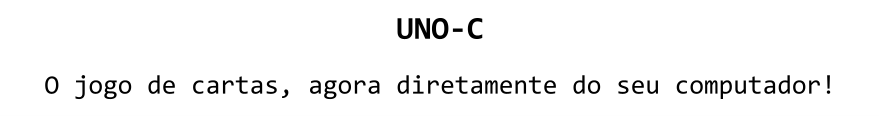

## Sobre o projeto

Essa é uma versão do popular jogo de cartas UNO, desenvolvida por mim; feita em linguagem C (como o nome já sugere), 
é o fruto de um projeto pessoal no qual trabalhei nas férias da minha faculdade de Engenharia da Computação, como uma forma de colocar em 
prática tudo o que aprendi nas aulas de programação ao longo do ano que passou — e que agora estou publicando aqui.

Foram semanas de esforço dedicadas não apenas a criar uma versão do jogo real, mas a reproduzir a experiência completa dela nos minimos 
detalhes — e sinceramente, eu não poderia estar mais orgulhoso do resultado final...

<div align="center">
    
</div>

### Principais destaques:
- Partidas entre 4 jogadores (você + 3 "bots");
- Todas as 108 cartas do baralho tradicional, com suas funções e efeitos;
- Todas as regras oficiais.

<div align="center">
    
</div>

<div align="center">
    
</div>

<div align="center">
    
</div>

## Como acessar o jogo

Para acessar o UNO-C, vá até a versão mais recente na aba [Releases](https://github.com/Matheus-Parreira/UNO-C/releases), e clique
na pasta com o código-fonte (Source code) e o arquivo .exe para baixa-los; descompacte a pasta, e coloque o arquivo .exe dentro dela,
de modo que o caminho para o arquivo esteja da seguinte forma:

```
...\UNO-C-(versão)\UNO-C.exe
```

## Feedback e atualizações

Pensei em bastante coisa para incluir no jogo, e ainda há algumas funcionalidades que eu gostaria de implementar eventualmente; 
mas agora com o projeto publicado, pretendo focar em outras coisas no momento — estudar, aprender mais, desenvolver novos projetos...

Porém, estou contando com o seu feedback (que é extremamente importante!) para garantir a qualidade do projeto, encontrando e corrigindo
eventuais problemas, fazendo comentários, e dando sugestões.

## Licença

O UNO-C é distribuido sob a [Licença MIT](LICENSE.txt).


